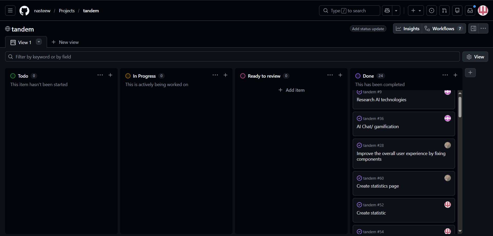

# 🤖 О проекте

> **Tandem** — это приложение для подготовки к JavaScript-собеседованиям, объединяющая симуляцию реальных интервью, геймификацию и аналитику прогресса.
Пользователи могут проходить собеседования с AI в текстовом и голосовом формате, тренироваться через интерактивные игровые задания и отслеживать свой прогресс с помощью продвинутого дашборда.

---

## 🌐 Deploy

https://tandem-ai-iota.vercel.app

## Демо-видео

🔗 **[Смотреть демо](https://youtu.be/iYzB0IfR7PU)**

---

## 🏆 Чем гордимся

Мы гордимся тем, что за короткий срок освоили новый стек и сделали полноценное приложение с продуманной архитектурой.

### Основные достижения:
- **AI-интервьюер:** поддержка уровней Junior / Middle / Senior, текстовый и голосовой режим, имитация реального технического интервью.
- **Widget Engine:** собственный расширяемый движок для интерактивных игровых модулей, позволяющий легко добавлять новые задания без изменения базовой архитектуры.
- **Игровые виджеты:** Async Sorter, Code Completion, Quiz, True/False, с настройкой уровня сложности для каждого задания.
- **Дашборд и прогресс:** сохранение последнего уровня каждого виджета, отображение стриков, лучшее время по виджетам, история сессий и общая активность пользователя.
- **Глобальная статистика:** сравнение результатов пользователей, средний стрик, лидерборды и общее количество уровней на платформе, сортировка пользователей.
- **Профили пользователей:** сохранение аватара, описание профиля и персонализация.
- **Аутентификация и безопасность:** удобная регистрация через Google, кастомная система аутентификации с использованием JWT-токенов, безопасное хранение данных и прогресса в локальной базе данных.
- **UX/UI:** мультиязычность (RU/EN), светлая и тёмная темы, удобный и приятный интерфейс для всех устройств.

Мы сделали не просто приложение, а удобную и гибкую платформу, которая помогает тренироваться в прохождении собеседований, прокачивать знания через игры и отслеживать свой прогресс, а также имеет соревновательный элемент за счет глобальной статистики по пользователям.

---

## 👥 Команда проекта

- [aleks6699](https://github.com/aleks6699)

- [nasteew](https://github.com/nasteew) [development-notes](https://github.com/nasteew/tandem/tree/main/development-notes/nasteew)

- [anastasiashlyk](https://github.com/anastasiashlyk) [development-notes](https://github.com/nasteew/tandem/tree/main/development-notes/anastasiashlyk)

- [imagineapril](https://github.com/imagineapril) [development-notes](https://github.com/nasteew/tandem/tree/main/development-notes/imagineapril)

---

## 🛠 Стек технологий

**Backend:**
- NestJS
- JWT
- PostgreSQL
- Supabase

**Frontend:**
- React
- TypeScript
- Tailwind CSS
- Zustand
- React Query (TanStack Query)
- React Router

**AI/ML:**
- OpenRouter API
- Голосовой ввод/вывод

**DevOps:**
- Vercel
- GitHub Actions

---

## 📌 Project Board:

- Ссылка: https://github.com/users/nasteew/projects/1
- Скриншот: 

---

## ⭐ Лучшие PR

- PR #1 — [Сreate statistics page](https://github.com/nasteew/tandem/pull/66)
- PR #2 — [Store conversation history](https://github.com/nasteew/tandem/pull/30)
- PR #3 — [Create code completion widget](https://github.com/nasteew/tandem/pull/64)
- PR #4 — [Create statistics](https://github.com/nasteew/tandem/pull/53)

---

## 📝 Meeting Notes

- Meeting 1 — [распределение ролей и обсуждение стека](https://github.com/nasteew/tandem/blob/main/development-notes/imagineapril/imagineapril-2026-02-19.md#%D0%BD%D0%B5%D0%B4%D0%B5%D0%BB%D1%8F-1)
- Meeting 2 — [созвон с ментором и обсуждение написанного кода](https://github.com/nasteew/tandem/blob/main/development-notes/anastasiashlyk/anastasiashlyk-2026-02-18.md#18022026)
- Meeting 3 — [обсуждение структуры финальных страниц Dashboard и Statistics](https://github.com/nasteew/tandem/blob/main/development-notes/nasteew/nasteew-2026-03-20.md)

---

## 🧾 Executive Summary

Многие разработчики сталкиваются с трудностями при подготовке к JavaScript-собеседованиям: нет удобной платформы, которая сочетала бы практику реальных интервью, интерактивные задания и возможность отслеживать прогресс.

Мы разработали **Tandem** — интерактивную AI-платформу для подготовки к JavaScript-собеседованиям, которая решает эту проблему, объединяя **реалистичные AI-интервью**, обучающие **виджеты** и **аналитику прогресса**.

Платформа построена на современном стеке (**React, NestJS, OpenRouter, Supabase**) и разработана как масштабируемая архитектура, готовая к добавлению новых функций.

Пользователи взаимодействуют с **AI-интервьюером** в текстовом и голосовом формате, выбирают уровень сложности (Junior / Middle / Senior) и проходят реалистичные собеседования с обратной связью в реальном времени.

Мы создали **widget engine**, который позволяет добавлять новые интерактивные задания без изменения базового кода. На его основе реализованы игровые модули: **Async Sorter, Code Completion, Quiz, True/False**, каждый с настраиваемой сложностью и адаптацией под уровень пользователя.

Платформа включает **продвинутый дашборд**, где сохраняется **прогресс пользователя**: стрики по дням, лучшее время, история сессий и возможность продолжить с того уровня, на котором остановился.

Реализована **страница глобальной статистики** и сравнение пользователей: лидерборды, средний стрик, общее количество уровней — это мотивирует пользователей и помогает отслеживать их рост.

Каждый пользователь имеет **полноценный профиль** с аватаркой, описанием и персональными настройками, а также возможность управлять своим аккаунтом.

Для удобства реализована **авторизация через Google** и **кастомная система аутентификации с JWT-токенами**, обеспечивающая безопасное хранение данных и прогресса пользователей в базе PostgreSQL.

Платформа поддерживает **мультиязычность (RU/EN)** и **светлую и тёмную темы**, а интерфейс продуман для удобного и интуитивного взаимодействия на всех устройствах.

Tandem делает подготовку к собеседованиям простой, интересной и мотивирующей. Пользователи могут учиться, играть, соревноваться и отслеживать свой прогресс — всё в одном месте и в удобном формате.